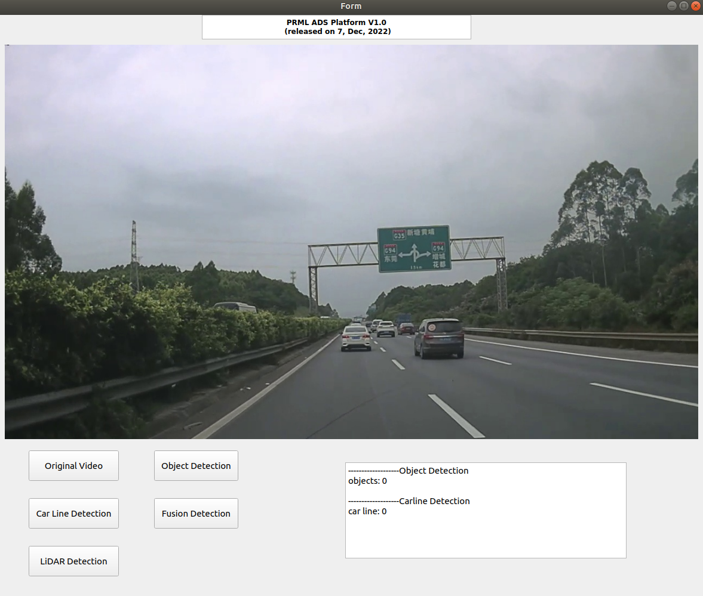

# PRML_ADS_Platform
This is our first basic ADS platform. This demo shows some basic functions.

## Importance
1. Our platform is based on python environment on Ubuntu system. Considering the complex installation procedures, we package the project into an executable file, which is friendly to users. Please download the whole project from GoogleDrive at [https://drive.google.com/file/d/109Xa72XHOr9Pf4JhfrTbpmRtkPmIhHrB/view?usp=share_link](https://drive.google.com/file/d/1zf-dUPVW-piU6TZRYhRmXpNoXa5BCDGV/view?usp=share_link)
2. cd to the project
    ```
    unzip PRML_ADS_Platform_v1.0.zip
    cd PRML_ADS_Platform_v1.0
    ```
3.  run test
    ```
    ./dist/test/test
    
4. UI Quick Demo

<p align="center">
  
</p>

## Update: a demo video uploaded.

-Bilibili 演示视频（户外）: [点击观看](https://www.bilibili.com/video/BV1eL2VBkEs3/?spm_id_from=333.1387.homepage.video_card.click&vd_source=dcc12a6fc4b4581b6a4578b624a7e6e6)

-Bilibili 演示视频（室内）: [点击观看](bilibili.com/video/BV19L2VBkErg/?spm_id_from=333.1387.homepage.video_card.click)
